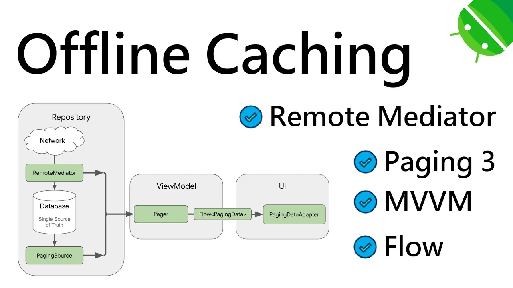
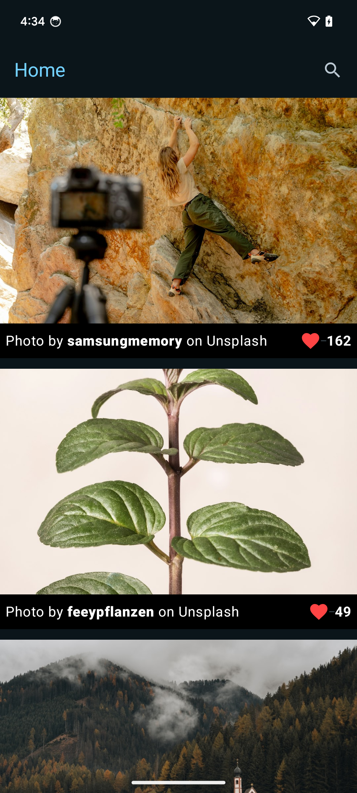
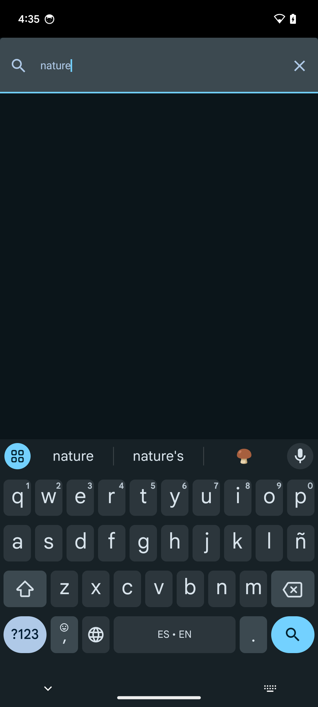
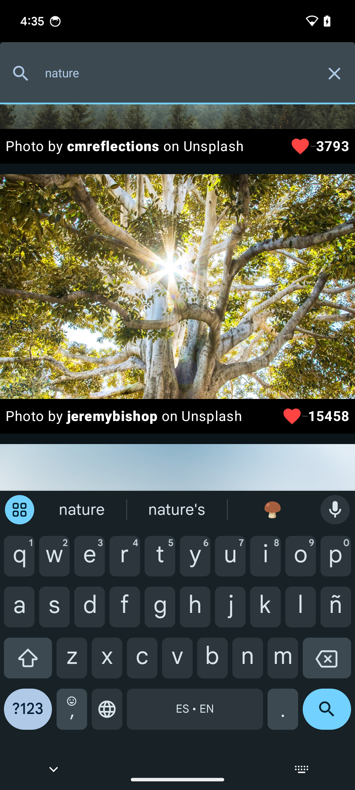

# Unsplash App

Esta aplicacion fue hecha con jetpack compose, utilizando kotlin dsl en lugar de groovy.

## Librerias

Room: Para almacenar la data recibida de la api rest unsplash.

Coil: Para mostrar las imagenes desde la red con la url.

Retrofit: Para realizar las llamadas a los endpoints de la api rest unsplash.

Paging 3: Para relizar la paginacion con lazyloading.

Dagger: Para utilizar inyeccion de dependencias.


## Uso

Para ejecutar la app se debe disponer de un access key de la api de unsplash https://unsplash.com/developers, luego agregar lo siguiente al archivo local.properties

```
API_KEY="Access Key"
```


## Patron de diseño

Este patron consiste en que la capa repository se encarga de obtener la informacion ya sea de la api rest o de la base de datos local.



# Screenshots

Pagina Inicio



Busqueda de imagen



Resultado de busqueda


